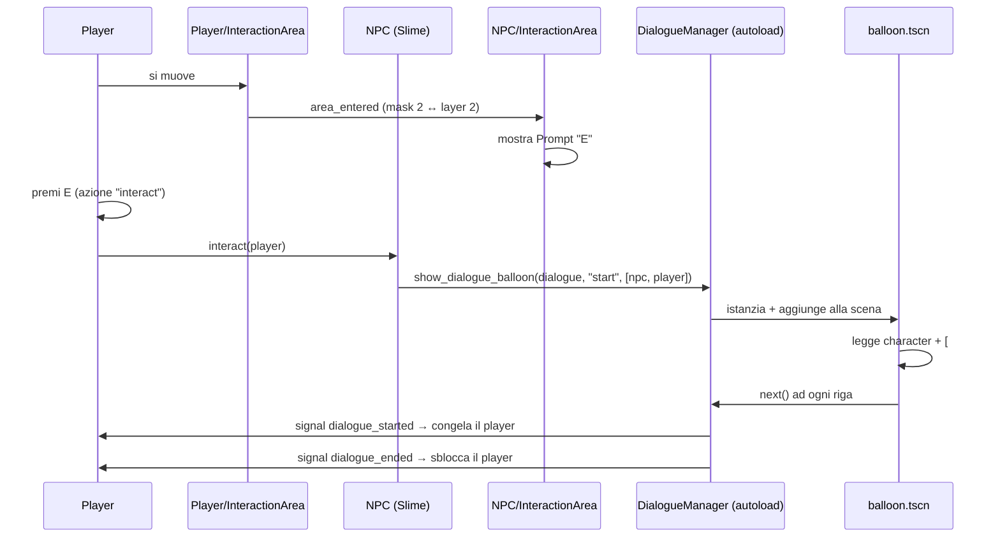

# 📖 Guida alla gestione dei dialoghi

Questa cartella contiene tutto il sistema di comunicazione tra i personaggi del gioco, basato sul plugin **Dialogue Manager** (Nathan Hoad).

Qui trovi: come si scrivono i dialoghi, come si gestiscono i ritratti, come si aggiunge un nuovo personaggio e come personalizzare la grafica della chatbox.

---

## 📑 Indice

1. [Struttura dei file](#-struttura-dei-file)
2. [Come funziona il flusso](#-come-funziona-il-flusso)
3. [Scrivere i dialoghi](#-scrivere-i-dialoghi)
4. [Personaggi e ritratti](#-personaggi-e-ritratti)
5. [Aggiungere un nuovo NPC](#-aggiungere-un-nuovo-npc)
6. [Risposte multiple (scelte)](#-risposte-multiple-scelte)
7. [Condizioni e variabili](#-condizioni-e-variabili)
8. [Mutazioni (`do` / `set`)](#-mutazioni-do--set)
9. [Altri costrutti](#-altri-costrutti)
10. [Tag e BBCode](#-tag-e-bbcode)
11. [Personalizzare la grafica della chatbox](#-personalizzare-la-grafica-della-chatbox)
12. [API e segnali nel codice](#-api-e-segnali-nel-codice)
13. [Riferimento rapido](#-riferimento-rapido)
14. [Risoluzione problemi](#-risoluzione-problemi)

---

## 🗂 Struttura dei file

```
Asset/Dialogue/
├── README.md                  ← questa guida
├── DialogueChat/              ← i testi dei dialoghi
│   └── Slime_Dialogue.dialogue
└── DialoguePannel/            ← la grafica della chatbox
	├── balloon.gd             ← logica del pannello (ritratti, nome, testo)
	└── balloon.tscn           ← scena del pannello
```

File collegati (fuori da questa cartella):

| File | Ruolo |
|---|---|
| `Asset/Script/player.gd` | Rileva il tasto **E** e chiama `interact()` sull'NPC più vicino |
| `Asset/Script/Slime.gd` | Esempio di NPC: apre il dialogo quando il player interagisce |
| `Scene/Player.tscn` | Contiene `InteractionArea` (l'area che rileva gli NPC) |
| `Scene/SlimeNpc.tscn` | Contiene `InteractionArea` + il prompt **E** |
| `project.godot` | Definisce l'azione input `interact` e il balloon di default |

---

## 🔄 Come funziona il flusso



**In parole povere:**

1. Il player (`InteractionArea`, `collision_mask = 2`) rileva l'area dell'NPC (`collision_layer = 2`, gruppo `interactable`).
2. L'NPC rileva il corpo del player (`InteractionArea`, `collision_mask = 1`) e mostra il prompt **E**.
3. Premendo **E**, `player.gd` cerca l'NPC più vicino e chiama `interact(self)`.
4. L'NPC apre il balloon passando `extra_game_states = [self, player]`, così le sue variabili sono leggibili nel dialogo.
5. Il player viene congelato finché il dialogo non finisce.

---

## ✍ Scrivere i dialoghi

I dialoghi vivono in file `.dialogue` dentro `Asset/Dialogue/DialogueChat/`. Godot li importa automaticamente come `DialogueResource`.

### Sintassi minima

```dialogue
~ start
Slime: Ciao! Sono uno slime.
Player: Piacere di conoscerti!
=> END
```

| Elemento | Significato |
|---|---|
| `~ start` | **Cue**: il punto di partenza. Il nome è arbitrario (`~ start`, `~ saluto`, `~ boss_fight`...) |
| `Nome: testo` | Una battuta. Tutto ciò che sta prima dei `:` è il **personaggio** |
| `=> END` | Termina il dialogo |
| `=> nome_cue` | Salta a un'altra cue (goto) |

> ⚠️ **Importante:** il nome del personaggio (`Slime:`) deve combaciare **esattamente** con la chiave usata nella mappa dei ritratti (vedi sotto). Maiuscole incluse!

### Commenti

```dialogue
# Questo è un commento e non viene mostrato nel gioco
Slime: Ciao!
```

> ⚠️ Il commento deve stare su una **riga propria**, all'inizio. Non sono supportati i commenti a fine riga.

### Cue multiple nello stesso file

Utile per organizzare dialoghi diversi dello stesso NPC:

```dialogue
~ start
Slime: Ciao!

~ primo_incontro
Slime: È la prima volta che ci vediamo!

~ dopo_la_quest
Slime: Hai finito la quest!
=> END
```

Per avviare una cue specifica, passa il nome come secondo parametro:

```gdscript
DialogueManager.show_dialogue_balloon(DIALOGO_SLIME, "primo_incontro")
```

### Continuare / terminare

```dialogue
~ start
Slime: A
Slime: B
=> fine_dialogo

~ fine_dialogo
Slime: Ciao ciao!
=> END
```

- `=> END` chiude il dialogo corrente.
- `=> END!` chiude **tutta** la conversazione (utile dentro le risposte annidate).
- Se non metti nessun `=>`, il dialogo finisce quando non ci sono più righe.

---

## 🖼 Personaggi e ritratti

Il ritratto che appare a sinistra nella chatbox viene scelto con questa priorità:

1. **Tag esplicito** sulla riga → `[#portrait=res://...]`
2. **Mappa dei ritratti** (`Character Portraits`) sul nodo radice del balloon
3. **Nessun ritratto** → il quadratino grigio sparisce (utile per la narrazione)

### 1. Mappa dei ritratti (consigliato)

Apri `Asset/Dialogue/DialoguePannel/balloon.tscn`, seleziona il nodo radice **`ExampleBalloon`** e modifica la proprietà esportata **`Character Portraits`** nell'inspector:

| Chiave | Valore |
|---|---|
| `Slime` | `Slime 01.png` (o un `AtlasTexture`) |
| `Player` | `Player.png` (o un `AtlasTexture`) |

Puoi assegnare:
- una **texture** trascinata dall'inspector,
- oppure un **percorso testuale** (String) tipo `res://Asset/Sprite/NPC/Slime 01.png`.

Il codice che risolve il ritratto è in `balloon.gd`:

```gdscript
func _get_portrait_for(line: DialogueLine) -> Texture2D:
	var tag_value: String = line.get_tag_value("portrait")   # 1. tag esplicito
	if not tag_value.is_empty():
		return _load_portrait(tag_value)

	var fallback: Variant = character_portraits.get(line.character, null)  # 2. mappa
	if fallback is Texture2D:
		return fallback
	if fallback is String:
		return _load_portrait(fallback)

	return null  # 3. nessun ritratto
```

### 2. Tag per singola riga

Per cambiare ritratto solo su **una** battuta (es. un'emozione diversa):

```dialogue
Slime: [#portrait=res://Asset/Sprite/NPC/Slime 01.png] Ciao!
Slime: [#portrait=res://Asset/Sprite/NPC/Slime arrabbiato.png] Ma che vuoi?!
```

Il tag `[#portrait=...]` viene rimosso dal testo mostrato, quindi non appare nella chatbox.

> 💡 Il tag esplicito funziona su **qualsiasi** riga. La mappa dei ritratti invece si basa sul nome del personaggio, quindi per le righe di **narrazione** (senza `Nome:`) serve il tag `[#portrait=...]` se vuoi mostrare un'immagine.

### 3. Dimensione del ritratto

Sempre sull'`ExampleBalloon` → proprietà **`Portrait Size`** (default `140 × 140`).

- Imposta `Vector2(0, 0)` per nascondere completamente il quadratino.
- Il ritratto mantiene le proporzioni ed è centrato nel quadrato.

---

## 🧑‍🤝‍🧑 Aggiungere un nuovo NPC

Segui questi passaggi per far parlare un nuovo personaggio (es. un "Goblin").

### Passo 1 — Crea la scena dell'NPC

Crea una nuova scena con radice `CharacterBody2D` (o duplica `SlimeNpc.tscn`).

### Passo 2 — Aggiungi l'area di interazione

Sotto la radice aggiungi:

```
Goblin (CharacterBody2D)
├── AnimatedSprite2D
├── CollisionShape2D
└── InteractionArea (Area2D)          ← collega al gruppo "interactable"
    ├── CollisionShape2D
    └── Prompt (Node2D)               ← il quadratino con la "E"
        ├── Background (Panel)
        └── Label (Label)
```

Configura così:

| Nodo | Proprietà | Valore |
|---|---|---|
| `InteractionArea` | **Gruppi** | `interactable` |
| `InteractionArea` | **Collision → Layer** | `2` (l'area che il player rileva) |
| `InteractionArea` | **Collision → Mask** | `1` (per rilevare il corpo del player) |
| `CollisionShape2D` | Shape | `CircleShape2D` raggio ~20 |
| `Prompt` | visibile | `false` (di default) |
| `Prompt` | position | `(0, -18)` e `scale 0.25` (come lo Slime) |

> ⚠️ Se dimentichi il gruppo `interactable`, il player **non** vedrà l'NPC.

### Passo 3 — Crea lo script

```gdscript
extends CharacterBody2D

@onready var interaction_area: Area2D = $InteractionArea
@onready var interaction_prompt: Node2D = $InteractionArea/Prompt

const DIALOGO_GOBLIN = preload("res://Asset/Dialogue/DialogueChat/Goblin_Dialogue.dialogue")

var active_balloon: Node = null
var is_player_nearby: bool = false


func _ready() -> void:
	interaction_prompt.visible = false
	interaction_area.body_entered.connect(_on_interaction_area_body_entered)
	interaction_area.body_exited.connect(_on_interaction_area_body_exited)


## Chiamata dal player quando preme "E".
func interact(interactor: Node = null) -> void:
	if is_instance_valid(active_balloon):
		return

	interaction_prompt.visible = false

	# Passiamo noi stessi al dialogo: così possiamo usare le nostre variabili
	var extra_game_states: Array = [self]
	if interactor != null:
		extra_game_states.append(interactor)

	active_balloon = DialogueManager.show_dialogue_balloon(DIALOGO_GOBLIN, "start", extra_game_states)
	DialogueManager.dialogue_ended.connect(_on_dialogue_ended, CONNECT_ONE_SHOT)


func _on_dialogue_ended(_resource: DialogueResource) -> void:
	active_balloon = null
	interaction_prompt.visible = is_player_nearby


func _on_interaction_area_body_entered(body: Node2D) -> void:
	if body.is_in_group("player"):
		is_player_nearby = true
		interaction_prompt.visible = true


func _on_interaction_area_body_exited(body: Node2D) -> void:
	if body.is_in_group("player"):
		is_player_nearby = false
		interaction_prompt.visible = false
```

> ✅ La funzione deve chiamarsi esattamente **`interact(interactor)`**: è il nome che `player.gd` cerca.

### Passo 4 — Crea il file di dialogo

`Asset/Dialogue/DialogueChat/Goblin_Dialogue.dialogue`

```dialogue
~ start
Goblin: Grrr! Cosa vuoi?
Player: Volevo solo salutarti.
Goblin: ...saluta e vattene!
=> END
```

### Passo 5 — Aggiungi il ritratto

Su `balloon.tscn` → `ExampleBalloon` → **Character Portraits**, aggiungi la chiave `Goblin` con la sua texture.

> ⚠️ La chiave deve essere **identica** al nome usato nel `.dialogue` (`Goblin`), altrimenti non appare nessun ritratto.

### Passo 6 — Aggiungi l'NPC alla mappa

Apri `Scene/Main.tscn` e trascina la scena del Goblin (istanza come figlia di `Main`).

Fatto! Ora avvicinandoti con il player e premendo **E** partirà il dialogo. 🎉

### Riepilogo rapido

```
1. Scena NPC con CharacterBody2D
2. Area2D "interaction_area" → gruppo "interactable", layer 2, mask 1
3. Script con func interact(interactor)
4. File .dialogue con il personaggio (es. "Goblin:")
5. Ritratto nella mappa Character Portraits del balloon
6. Istanza nella scena Main
```

---

## 🔀 Risposte multiple (scelte)

Le risposte si scrivono con `- ` e i contenuti annidati vanno **indentati con una tabulazione**.

```dialogue
~ start
Slime: Vuoi giocare con me?
- Sì, volentieri!
	Slime: Evviva!
	=> fine
- No, ho da fare.
	Slime: Uffa...
	=> fine

~ fine
Slime: Ci vediamo in giro!
=> END
```

**Regole:**

| Regola | Dettaglio |
|---|---|
| Prefisso | Ogni opzione inizia con `- ` |
| Indentazione | Il corpo dell'opzione deve essere indentato con **Tab** (non spazi) |
| Fine gruppo | Una riga non indentata chiude il blocco delle risposte |
| Nessun `=>` | Se l'opzione non salta da nessuna parte, il dialogo continua normalmente |

### Risposte condizionali

Un'opzione può apparire solo se una condizione è vera. La condizione si mette tra `[if ... /]`:

```dialogue
Slime: Cosa vuoi fare?
- Combattere [if ha_spada /]
	Slime: Sei pronto!
- Parlare
	Slime: Ok, parliamo.
=> END
```

> Le opzioni non valide vengono **nascoste** automaticamente.

---

## 🧮 Condizioni e variabili

### Variabili: da dove arrivano

Il Dialogue Manager risolve le variabili cercandole in quest'ordine:

1. Gli **`extra_game_states`** passati da `show_dialogue_balloon(...)` (es. `[self, player]`)
2. Gli **autoload** del progetto
3. La **scena corrente**
4. Le **classi globali** registrate

Quindi, se nel tuo NPC hai una variabile `var salute = 100`, puoi usarla direttamente nel dialogo!

### Condizioni `if` / `elif` / `else`

```dialogue
~ start
if salute > 50:
	Slime: Sto benissimo!
elif salute > 10:
	Slime: Sono un po' ferito...
else:
	Slime: Aiuto... sto male...
=> END
```

> Il corpo del blocco va indentato con **Tab**. I due punti finali `:` sono opzionali.

### Operatori supportati

| Tipo | Operatori |
|---|---|
| Confronto | `==`, `!=`, `<`, `>`, `<=`, `>=` |
| Logici | `and`, `or`, `not` (anche `&&`, `\|\|`, `!`) |
| Appartenenza | `in` (es. `"spada" in inventario`) |
| Aritmetica | `+`, `-`, `*`, `/`, `%` |
| Assegnazione | `=`, `+=`, `-=`, `*=` , `/=` |

### Esempio: dialogo diverso in base allo stato

```dialogue
~ start
if prima_volta:
	Slime: Ciao! Non ti ho mai visto!
	do prima_volta = false
else:
	Slime: Ciao di nuovo!
=> END
```

---

## ⚙ Mutazioni (`do` / `set`)

Le mutazioni modificano le variabili del gioco.

| Comando | Uso |
|---|---|
| `do espressione` | Esegue un'assegnazione o chiama una funzione |
| `set espressione` | Sinonimo di `do` |
| `do! espressione` | Come `do`, ma **non** attende (non mostrato come riga separata) |

```dialogue
~ start
Slime: Tieni, 10 monete!
do monete += 10
Slime: Ora ne hai {{monete}}!
=> END
```

### Mutazioni inline (dentro una battuta)

Usando `[do ...]` o `[$> ...]` direttamente nel testo:

```dialogue
Slime: Boom![$> salute -= 10] Ahia!
```

### Chiamare funzioni

```dialogue
~ start
Slime: Alziamo la bandiera!
do bandiera.alza()
Slime: Fatto!
=> END
```

### Sostituzione di variabili nel testo

Con le doppie graffe puoi mostrare il valore di una variabile:

```dialogue
Player: Ho ben {{monete}} monete e {{inventario.size()}} oggetti.
```

---

## 🎲 Altri costrutti

### Righe casuali (`%`)

```dialogue
~ start
% Slime: Ciao!
% Slime: Ehi, ciao!
% Slime: Buongiorno!
=> END
```

#### Righe casuali pesate

Un numero dopo `%` indica il **peso** (probabilità relativa):

```dialogue
~ start
% Slime: Ciao!
%2 Slime: Ehi, come va?
=> END
```

Nell'esempio sopra la seconda riga ha il doppio delle probabilità di uscire rispetto alla prima.

#### Casuali con condizione

```dialogue
~ start
% [if livello > 5 /] Slime: Sei forte ora!
% Slime: Ciao!
=> END
```

### Casuale inline

```dialogue
Slime: [[Ciao!|Ehi!|Buongiorno!]]
```

### `match` / `when`

Utile per confrontare una variabile con più valori. Il caso di default si scrive con `else:`.

```dialogue
~ start
match meteo:
	when "sole"
		Slime: Che bella giornata!
	when "pioggia"
		Slime: Che brutto tempo...
	else
		Slime: Boh.
=> END
```

Sono supportati anche più valori separati da virgola e i confronti:

```dialogue
~ start
match livello:
	when 1, 2
		Slime: Sei alle prime armi.
	when > 10
		Slime: Sei un veterano!
	else
		Slime: Continua così.
=> END
```

### `while`

```dialogue
~ start
do contatore = 0
while contatore < 3:
	Slime: Giro numero {{contatore}}
	do contatore += 1
=> END
```

### Condizionali inline nel testo

```dialogue
Slime: [if monete > 100]Sei ricco![else]Sei povero![/if]
```

---

## 🏷 Tag e BBCode

### Tag personalizzati `[#...]`

Si scrivono tra parentesi quadre con il cancelletto e **non** vengono mostrati nel testo.

```dialogue
Slime: [#portrait=res://Asset/Sprite/NPC/Slime 01.png] Ciao!
```

Più tag insieme, separati da virgola:

```dialogue
Slime: [#portrait=res://... , voice=res://Asset/audio/voce.mp3] Ciao!
```

| Tag | Effetto | Gestito da |
|---|---|---|
| `[#portrait=res://...]` | Sostituisce il ritratto mostrato | `balloon.gd` |
| `[#voice=res://...]` | Riproduce un audio e aspetta la fine | `balloon.gd` |

> Puoi aggiungere nuovi tag personalizzati estendendo `balloon.gd` e usando `dialogue_line.get_tag_value("nome_tag")`.

### Marcatori inline avanzati

Questi si mettono **dentro** il testo della battuta:

| Marcatore | Effetto |
|---|---|
| `[wait=1.5]` | Pausa il typing per 1.5 secondi |
| `[speed=0.01]` ... `[/speed]` | Cambia la velocità di scrittura |
| `[next=2]` | Va avanti da solo dopo 2 secondi |
| `[next=auto]` | Va avanti da solo dopo un tempo calcolato dal testo |
| `[do variabile = valore]` | Mutazione inline |
| `[[opzione A\|opzione B]]` | Sceglie casualmente una delle opzioni |
| `[if cond]testo[/if]` | Mostra il testo solo se la condizione è vera |

### BBCode di Godot

Essendo un `RichTextLabel`, sono supportati tutti i tag BBCode di Godot:

```dialogue
Slime: Questo è [b]grassetto[/b], questo [i]corsivo[/i], questo [color=red]rosso[/color].
Slime: Un'icona: [img]res://icon.svg[/img]
```

### Testo statico e traduzioni

Per dare un ID fisso a una riga (usato per le traduzioni):

```dialogue
Slime: [ID:SALUTO_SLIME] Ciao!
```

### Caratteri speciali da "scappare"

Se devi scrivere letteralmente `~`, `-`, `%`, `=>` o `if` a inizio riga, anteponi un backslash:

```dialogue
Slime: \~ non è una cue
```

---

## 🎨 Personalizzare la grafica della chatbox

Apri `Asset/Dialogue/DialoguePannel/balloon.tscn`. La struttura è:

```
ExampleBalloon (CanvasLayer, layer 100)
└── Balloon (Control, tutto lo schermo)
	└── MarginContainer          ← offset_top = -540 (altezza area dialogo)
		└── ContentLayout (VBoxContainer)
			├── Spacer (Control)              ← spinge il resto in basso
			└── PanelContainer                ← 🔲 la nuvoletta bianca
				└── MarginContainer
					└── HBoxContainer
						├── PortraitFrame (PanelContainer)  ← quadratino grigio
						│   └── Portrait (TextureRect)      ← immagine
						├── VBoxContainer
						│   ├── CharacterLabel (RichTextLabel)  ← nome
						│   └── DialogueLabel (RichTextLabel)   ← testo
						└── Control
							└── Progress (Polygon2D)            ← freccia "avanti"
```

### Modifiche più comuni

| Cosa vuoi cambiare | Dove |
|---|---|
| **Colore/angoli della nuvoletta** | `PanelContainer` → `theme_override_styles/panel` → `StyleBoxFlat_togfq` |
| **Sfondo grigio del ritratto** | `PortraitFrame` → `theme_override_styles/panel` → `StyleBoxFlat_portrait` |
| **Dimensione ritratto** | `ExampleBalloon` → `Portrait Size`, oppure `PortraitFrame` → `custom_minimum_size` |
| **Colore/dimensione del nome** | `CharacterLabel` → `theme_override_colors/default_color` e `theme_override_font_sizes/normal_font_size` |
| **Colore/dimensione del testo** | `DialogueLabel` → le stesse proprietà |
| **Altezza dell'area dialogo** | `MarginContainer` → `offset_top` |
| **Spazio tra ritratto e testo** | `HBoxContainer` → `theme_override_constants/separation` |
| **Margine interno della nuvoletta** | `PanelContainer/MarginContainer` → override dei margini |

### Il prompt "E" sull'NPC

In `Scene/SlimeNpc.tscn`, sotto `InteractionArea/Prompt`:

- **`Background`** = il quadratino semi-trasparente (`StyleBoxFlat_prompt`, `bg_color` con alpha ~0.65)
- **`Label`** = la lettera `E`

Per cambiare il tasto mostrato, modifica `text` del `Label` **e** l'azione input in `project.godot`.

---

## 🔌 API e segnali nel codice

### Segnali globali (autoload `DialogueManager`)

```gdscript
DialogueManager.dialogue_started.connect(_on_dialogue_started)   # dialogo iniziato
DialogueManager.dialogue_ended.connect(_on_dialogue_ended)       # dialogo finito
DialogueManager.got_dialogue.connect(_on_got_dialogue)           # nuova riga caricata
DialogueManager.mutated.connect(_on_mutated)                     # variabile modificata
DialogueManager.waiting_for_input.connect(_on_waiting)           # attesa input
```

I primi due sono già usati in `player.gd` per **congelare/sbloccare** il giocatore.

### Avviare un dialogo

```gdscript
# Usa il balloon di default (impostato in project.godot)
DialogueManager.show_dialogue_balloon(resource, "cue", [stati_extra])

# Usa un balloon specifico
DialogueManager.show_dialogue_balloon_scene("res://path/balloon.tscn", resource, "cue")

# Cambia il balloon di default
DialogueManager.set_default_balloon("res://Asset/Dialogue/DialoguePannel/balloon.tscn")
```

| Parametro | Descrizione |
|---|---|
| `resource` | Il `DialogueResource` (il file `.dialogue` importato) |
| `cue` | Da quale `~ cue` partire (default: la prima) |
| `extra_game_states` | Array di oggetti/dizionari da cui leggere le variabili |

### Leggere lo stato dal dialogo

Passando `[self]` in `extra_game_states`, il dialogo può leggere le variabili pubbliche dello script:

```gdscript
# Goblin.gd
var reputazione: int = 5

# Goblin_Dialogue.dialogue
# if reputazione > 10:
#     Goblin: Sei un amico!
```

### Sensori sulla singola riga (script custom)

```gdscript
var line: DialogueLine = await resource.get_next_dialogue_line("start")
print(line.character)                      # nome personaggio
print(line.text)                           # testo (senza tag)
print(line.responses.size())               # numero di risposte
print(line.has_tag("portrait"))            # ha il tag?
print(line.get_tag_value("portrait"))      # valore del tag
```

### Il tasto di interazione

In `project.godot` → sezione `[input]` → azione **`interact`** (attualmente tasto **E**, keycode 69).

In `player.gd`:

```gdscript
const INTERACT_ACTION := &"interact"
```

---

## 📋 Riferimento rapido

### Sintassi

| Sintassi | Significato |
|---|---|
| `~ cue` | Inizio di una cue |
| `Nome: testo` | Battuta |
| `# commento` | Commento |
| `- opzione` | Risposta / scelta |
| `=> cue` | Salta alla cue |
| `=> END` | Fine dialogo |
| `=> END!` | Fine di tutta la conversazione |
| `if` / `elif` / `else` | Condizioni |
| `while` / `match` / `when` | Cicli e selezioni |
| `do` / `set` | Mutazioni |
| `%` / `%2` | Riga casuale (pesata) |
| `[[a\|b]]` | Casuale inline |
| `{{variabile}}` | Interpolazione |
| `[#tag=valore]` | Tag custom |
| `[ID:nome]` | ID statico per traduzioni |
| `\` | Escape |

### Checklist nuovo personaggio

```
☐ Scena con CharacterBody2D
☐ Area2D nel gruppo "interactable", layer 2, mask 1
☐ Prompt "E" figlio dell'Area2D
☐ Script con func interact(interactor)
☐ File .dialogue in DialogueChat/
☐ Ritratto in Character Portraits del balloon (chiave = nome nel dialogo)
☐ Istanza nella scena di gioco
```

---

## 🔧 Risoluzione problemi

| Problema | Causa probabile | Soluzione |
|---|---|---|
| Il tasto **E** non fa nulla | L'area dell'NPC non è nel gruppo `interactable` | Aggiungi il gruppo a `InteractionArea` |
| Il dialogo non parte | Manca `func interact(interactor)` | Il nome della funzione deve essere esatto |
| Nessun ritratto | La chiave in `Character Portraits` ≠ nome nel `.dialogue` | Controlla maiuscole e spazi |
| Il ritratto non si vede | Texture non assegnata, o `Portrait Size` = 0 | Verifica `Portrait Size` e la texture |
| Il player continua a muoversi | Segnali non collegati | `DialogueManager.dialogue_started/ended` in `player.gd` |
| Il player **attacca** chiudendo il dialogo | Spazio è sia attacco sia "avanza" | Già risolto con `attack_cooldown` in `player.gd` |
| "Property not found" nel dialogo | Variabile non passata | Aggiungi l'oggetto a `extra_game_states`, o usa un autoload |
| Le modifiche al `.dialogue` non si vedono | Godot non ha reimportato | Salva il file e torna sull'editor Godot |
| Errore di indentazione | Usati spazi invece di Tab | Indenta con **Tab** |

### Dove cercare gli errori

Apri il pannello **Debugger → Errors** in Godot. Il Dialogue Manager segnala lì gli errori di compilazione dei `.dialogue`, con numero di riga.

---

## 📚 Documentazione ufficiale

- Repository: https://github.com/nathanhoad/godot_dialogue_manager
- Documentazione: https://dialogue-manager.readthedocs.io/

---

*Ultimo aggiornamento: 25/09/2026*
