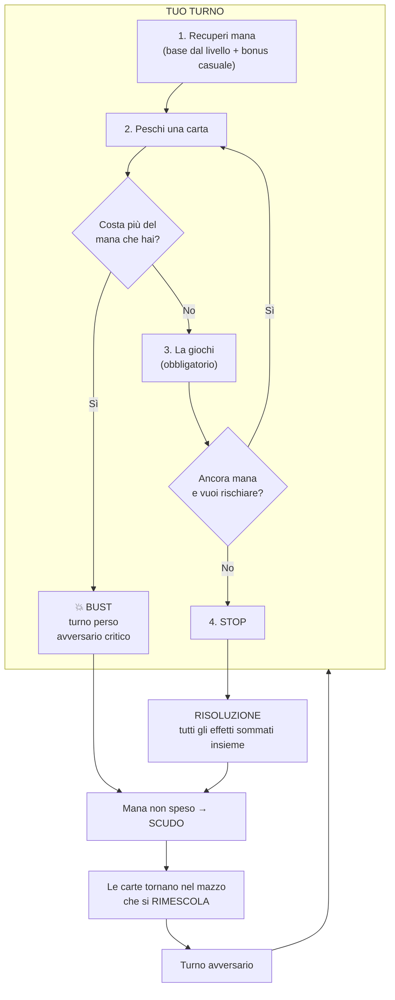
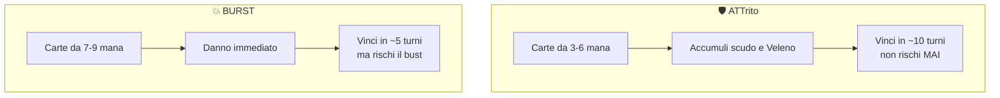

# 🃏 Sistema di carte e combattimento

Motore del card game: mazzi, mana, pesca, bust, elementi, status e sinergie.

**Questa cartella è isolata**: non tocca nulla del gioco esistente (dialoghi, player, scene). Puoi lavorarci senza rischi.

---

## 📑 Indice

1. [Le regole del gioco](#-le-regole-del-gioco)
2. [Da dove iniziare](#-da-dove-iniziare)
3. [Struttura dei file](#-struttura-dei-file)
4. [Creare una carta nuova](#-creare-una-carta-nuova)
5. [L'elenco degli effetti](#-lelenco-degli-effetti)
6. [Creare un effetto nuovo](#-creare-un-effetto-nuovo)
7. [Creare un mazzo](#-creare-un-mazzo)
8. [Assegnare un mazzo a un NPC](#-assegnare-un-mazzo-a-un-npc)
9. [Elementi e status](#-elementi-e-status)
10. [Le sinergie](#-le-sinergie)
11. [Tarare il bilanciamento](#-tarare-il-bilanciamento)
12. [Il simulatore](#-il-simulatore)
13. [Riferimento API](#-riferimento-api)
14. [Risoluzione problemi](#-risoluzione-problemi)

---

## 🎮 Le regole del gioco



### Regole chiave

| # | Regola |
|---|---|
| 1 | **1 contro 1.** Nessun bersaglio: colpisci sempre l'avversario |
| 2 | Turni **alternati classici** |
| 3 | **Nessuna mano.** Peschi e giochi finché hai mana |
| 4 | Se peschi una carta che puoi permetterti, sei **obbligato** a giocarla |
| 5 | Se non puoi permettertela → **BUST**: perdi il turno e l'avversario fa critico |
| 6 | Puoi dire **STOP** quando vuoi |
| 7 | **L'ordine delle carte non conta**: a fine turno si somma tutto |
| 8 | Il **mana non speso diventa scudo** — fermarsi è una scelta difensiva |
| 9 | Le carte **non si consumano mai**: tornano nel mazzo, che si rimescola |
| 10 | Le carte hanno **valori fissi**. La casualità sta solo nel *pescare* |

### 🏛 Il costo dice cosa fa la carta

**La regola strutturale del gioco**, più importante di qualsiasi numero:

```
3-4 mana  →  SETUP    Non fa danno. Scudo, cura, Congelato, buff.
5-6 mana  →  ATTrito  Brucia e Veleno: danno LENTO ma sicuro.
7-9 mana  →  BURST    Danno IMMEDIATO. Veloce, ma rischi il bust.
```

Da questa singola regola nascono **due modi di vincere**, e quindi tutto il gioco:

| Filosofia | Carte | Velocità | Rischio |
|---|---|---|---|
| 🛡 **Attrito** | 3-6 mana | ~10 turni | Quasi zero |
| 💥 **Burst** | 7-9 mana | ~5 turni | Alto (bust) |

Non è una scala di potenza: sono **due strategie opposte**. Vedi [la sezione dedicata](#-la-regola-strutturale-il-costo-dice-cosa-fa-la-carta) per il dettaglio e per il motivo per cui il Veleno non può stare tra le carte economiche.

### La decisione centrale

A ogni pesca il gioco ti chiede: **scudo sicuro o danno rischioso?**

- **Mi fermo** → il mana rimasto diventa scudo (difesa garantita)
- **Pesco** → una carta in più (danno/status), ma rischio di perdere il turno

Le due strategie devono restare bilanciate. Se una domina, il gioco si rompe:
- Se lo **scudo** rendesse più del danno → nessuno attacca, partite infinite
- Se il **bust** fosse troppo punitivo → nessuno rischia, sparisce il dilemma

Il [simulatore](#-il-simulatore) verifica automaticamente entrambe le cose.

> 💡 **Non esiste il bilanciamento perfetto.** I giocatori troveranno sempre i loro meta. L'obiettivo non è "numeri giusti", è che **molte strategie diverse restino sensate**.

### La pipeline del danno

```
Danno grezzo delle carte
  ↓ 1. Moltiplicatore per elemento (sinergie)
  ↓ 2. Moltiplicatore globale (carte di supporto + Potenziato)
  ↓ 3. Critico (se l'avversario ha fatto bust)
  ↓ 4. Riduzione % dello scudo avversario
  ↓ 5. Lo scudo assorbe e si consuma
  ↓ 6. Il resto va sulla vita
```

---

## 🚀 Da dove iniziare

**1. Gioca una partita con le tue mani** ⭐

Apri `Cards/table/play_table.tscn` e premi **F6**. Niente grafica elaborata: **testo e due pulsanti**.

| Pulsante | Tasto | Cosa fa |
|---|---|---|
| **PESCA** | `Spazio` | Pesca una carta (obbligatorio giocarla se puoi permettertela) |
| **STOP** | `S` | Chiudi il turno, il mana avanzato diventa scudo |
| **Nuova partita** | `N` | Ricomincia da capo |

La riga **"Rischio se peschi: X%"** è la probabilità esatta di perdere il turno. È l'informazione che ti serve per decidere — e ti fa capire subito se il bilanciamento funziona.

Puoi cambiare i mazzi e il seme dall'inspector del nodo `PlayTable`.

**2. Guarda il gioco funzionare (30 secondi)**

Apri `Cards/sim/sim_runner.tscn` e premi **F6**. Nel pannello *Output* vedrai:

- il report con le verifiche di bilanciamento
- una partita di esempio completa, riga per riga
- il confronto tra strategie e le varianti di bust
- l'analisi della potenza di ogni carta, raggruppata per tier
- il **torneo tra archetipi** e la taratura automatica

**3. Guarda una partita spiegata**

Apri `Cards/sim/battle_demo.tscn` e premi **F6**. Stampa una partita mostrando **perché** l'IA prende ogni decisione.

La modalità `RISK_ANALYSIS` mostra la probabilità di bust a ogni livello di mana: il grafico che spiega se il rischio è una scelta interessante.

**4. Crea le risorse modificabili**

Apri `Cards/tools/generate_cards.gd` e fai **File → Esegui**. Genera i `.tres` di tutte le carte, dei mazzi e delle sinergie, così li puoi modificare dall'inspector.

---

## 🗂 Struttura dei file

```
Cards/
├── README.md                        ← questa guida
├── data/
│   ├── card_types.gd                Enumerazioni (elementi, status, rarità)
│   ├── card_data.gd                 ★ La DEFINIZIONE di una carta
│   ├── deck_entry.gd                "questa carta x3"
│   ├── deck_data.gd                 ★ Il MAZZO
│   ├── card_library.gd              Le carte di esempio + le sinergie
│   ├── cards/                       ← .tres generati (crei le carte qui)
│   └── decks/                       ← .tres generati (i mazzi)
├── effects/
│   ├── card_effect.gd               ★ Classe base degli effetti
│   ├── effect_context.gd            Accumulatore del turno
│   ├── deal_damage_effect.gd        Infliggi N danni
│   ├── gain_shield_effect.gd        Guadagni N scudo
│   ├── heal_effect.gd               Recuperi N vita
│   ├── apply_status_effect.gd       Applica Brucia/Veleno/ecc.
│   ├── turn_damage_buff_effect.gd   +N% danno questo turno
│   ├── flat_damage_bonus_effect.gd  +N danno piatto questo turno
│   └── lose_health_effect.gd        Perdi N vita (carte rischiose)
├── battle/
│   ├── card_instance.gd             Una copia in partita
│   ├── battle_balance.gd            ★ TUTTI I NUMERI TARABILI
│   ├── battle_rng.gd                Casualità riproducibile
│   ├── status_stack.gd              Uno status attivo
│   ├── battle_player.gd             Vita, mana, scudo, danno
│   └── battle_state.gd              ★ Il motore dei turni
├── synergy/
│   ├── synergy_rule.gd              Una regola di sinergia
│   └── rules/                       ← .tres generati
├── sim/
│   ├── sim_ai.gd                    Le strategie dell'IA
│   ├── battle_simulator.gd          Motore delle simulazioni + report
│   ├── sim_runner.tscn/gd           ← F6 qui per le statistiche
│   └── battle_demo.tscn/gd          ← F6 qui per vedere una partita
├── table/
│   └── play_table.tscn/gd           ← F6 qui per GIOCARE una partita
└── tools/
    └── generate_cards.gd            Genera i .tres
```

### `CardData` vs `CardInstance`

**La distinzione più importante del progetto.**

| | `CardData` | `CardInstance` |
|---|---|---|
| Cos'è | Il "progetto" della carta | La "carta fisica" in partita |
| Dove vive | Un `.tres` in `data/cards/` | In memoria durante la battaglia |
| Cambia mai? | **No** | Sì (sconto sul costo, contatori) |
| Quanti | 1 per tipo | N (uno per ogni copia nel mazzo) |

Se il tuo mazzo ha **3 copie di Inferno**, esiste **un solo** `CardData` e **tre** `CardInstance`. È questo che permette di dare un buff a *una* copia senza rovinare le altre.

---

## 🃏 Creare una carta nuova

### Metodo A — dall'inspector (consigliato)

1. Apri il pannello **FileSystem** su `res://Cards/data/cards/`
2. Tasto destro → **Nuova risorsa…**
3. Cerca **`CardData`** → **Crea**
4. Compila i campi:

| Campo | Cosa scrivere |
|---|---|
| **Id** | `fire_inferno` (minuscolo, underscore, univoco) |
| **Display Name** | `Inferno` |
| **Cost** | `8` (tra 3 e 9 per restare bilanciato) |
| **Element** | `FIRE` |
| **Rarity** | `RARE` |
| **Effects** | Vedi sotto |

5. Su **Effects** premi *Aggiungi elemento* e scegli il tipo (`DealDamageEffect`, ecc.)
6. Espandi l'elemento appena creato e compila i suoi parametri (`Amount`, `Element Override`…)
7. Salva (Ctrl+S)

### Metodo B — dal codice

Utile per generare tante carte in blocco:

```gdscript
var card: CardData = CardLibrary.make_card(
    &"fire_inferno",                              # id
    "Inferno",                                    # nome
    8,                                            # costo
    CardTypes.Element.FIRE,                       # elemento
    CardTypes.Rarity.RARE,                        # rarità
    [                                             # effetti
        CardLibrary.damage(15),
        CardLibrary.status(CardTypes.StatusType.BURN, 2),
    ]
)
```

### Metodo C — modificare la libreria e rigenerare

1. Modifica `data/card_library.gd` (la tabella delle carte)
2. Esegui `tools/generate_cards.gd`
3. I `.tres` vengono rigenerati

### La descrizione automatica

Se lasci il campo **Description** vuoto, il testo della carta viene generato dagli effetti. Quindi se cambi `Amount` da 15 a 20, la descrizione si aggiorna da sola. Niente testo da tenere allineato a mano.

### Una carta con più effetti

```gdscript
CardLibrary.make_card(
    &"fire_ember_guard", "Guardia di Brace", 4,
    CardTypes.Element.FIRE, CardTypes.Rarity.UNCOMMON,
    [
        CardLibrary.damage(5),          # infliggi 5 danni Fuoco
        CardLibrary.shield(4),          # e guadagni 4 scudo
    ]
)
```

---

## ⚡ L'elenco degli effetti

| Effetto | Parametri | Fa |
|---|---|---|
| `DealDamageEffect` | `amount`, `element_override` | Infligge N danni |
| `GainShieldEffect` | `amount` | Guadagni N scudo |
| `HealEffect` | `amount` | Recuperi N vita |
| `ApplyStatusEffect` | `status`, `stacks`, `to_self` | Applica uno status |
| `TurnDamageBuffEffect` | `percent` | +N% danno a **tutto** il turno |
| `FlatDamageBonusEffect` | `amount` | +N danno piatto a ogni carta |
| `LoseHealthEffect` | `amount` | Perdi N vita (costo) |

### Perché "potenzia il turno" e non "potenzia la prossima carta"

Dato che la risoluzione è **simultanea** (l'ordine non conta), non esiste una "prossima carta". Quindi i potenziamenti valgono per tutto il turno. È il modo corretto di fare sinergie in questo sistema.

Conseguenza interessante: `TurnDamageBuffEffect` (+25%) è fortissimo con poche carte grosse, mentre `FlatDamageBonusEffect` (+3 piatto) è fortissimo con tante carte piccole. Due carte di supporto con identità diverse.

### Valori consigliati

| Effetto | Rapporto potenza/costo | Note |
|---|---|---|
| Danno puro | **1,5 - 2,5** | Il riferimento |
| Scudo | ×0,5 | Deve rendere meno del danno |
| Cura | ×0,6 | Non fa avanzare la partita |
| Veleno | ×2,0 per stack | Non si affievolisce mai |
| Brucia | ×1,5 per stack | Si affievolisce |
| Congelato | ×2,5 per stack | Situazionale |

Usa `sim_runner` in modalità `AUDIT` per controllare che le tue carte rispettino questi rapporti.

---

## 🔧 Creare un effetto nuovo

Un file nuovo, e non devi toccare nient'altro:

```gdscript
## Ruba 1 mana all'avversario.
class_name StealManaEffect extends CardEffect

@export var amount: int = 1

func apply(ctx: EffectContext) -> void:
    # NON modificare lo stato qui: accumula in ctx.
    # Se sottraessi mana adesso, l'ordine delle carte tornerebbe a contare.
    ctx.opponent_mana_penalty += amount

func describe() -> String:
    return "L'avversario perde %d mana" % amount

func power_score(_card: CardData) -> float:
    return float(amount) * 2.0
```

**La regola d'oro:** dentro `apply()` **non** modificare mai lo stato direttamente. Accumula tutto in `ctx` e lascia che `BattleState` applichi il totale. È ciò che rende l'ordine delle carte irrilevante.

### Cosa offre `EffectContext`

| Metodo | Cosa fa |
|---|---|
| `add_damage(amount, element)` | Accumula danno |
| `add_shield(amount)` | Accumula scudo |
| `add_heal(amount)` | Accumula cura |
| `add_self_damage(amount)` | Accumula danno su di te |
| `add_status(status, stacks, to_self)` | Mette in coda uno status |
| `multiply_all_damage(x)` | Moltiplica *tutto* il danno del turno |
| `multiply_element_damage(el, x)` | Moltiplica il danno di un elemento |
| `count_played_of_element(el)` | Quante carte di quell'elemento hai giocato |
| `add_log(text)` | Aggiunge una riga al log |

---

## 🎴 Creare un mazzo

1. Vai su `res://Cards/data/decks/`
2. Tasto destro → **Nuova risorsa…** → **`DeckData`**
3. Compila **Display Name**
4. Su **Entries** aggiungi una riga per carta:
   - **Card** → trascina il `.tres` della carta
   - **Count** → quante copie
5. Salva

### Mazzi di esempio già pronti

`CardLibrary` fornisce **otto** mazzi: gli archetipi sono "filosofie di gioco diverse", non livelli di forza.

| Mazzo | Com'è fatto | Come vince | Rischio |
|---|---|---|---|
| `build_veteran_deck()` — **Veterano** | Difesa economica, danno medio, 2 carte pesanti | Equilibrato, **senza trucchi** | Medio |
| `build_attrition_deck()` — **Attrito** | Difesa economica + Veleno | Lento, per accumulo | Basso |
| `build_starter_deck()` — **Equilibrato** | Metà setup, metà burst | Misto | Medio |
| `build_aggressive_deck()` — **Aggressivo** | Danno + moltiplicatori | Veloce, esplosivo | Alto |
| `build_burst_deck()` — **Esplosivo** | Quasi solo 6-9 mana | Velocissimo | Molto alto |
| `build_fortress_deck()` — **Fortezza** | Scudo a volontà | Lento, con pochi colpi | Basso |
| `build_elemental_deck(el)` — **Mono X** | Mono-elemento | Dipende dalle sinergie | Variabile |

> 🎯 **`Veterano` è l'avversario da usare contro un giocatore umano.** Non usa Veleno, non accumula scudo all'infinito, non sfrutta nessuna meccanica in modo estremo. Se batti *sempre* anche lui, il problema non è l'avversario.

> ⚠️ **Non tutti i mazzi sono avversari adatti.** Nella classifica del torneo `Aggressivo` e `Fortezza` stavano sotto il 10%: usarli come avversario fa sembrare il gioco rotto. Il tavolo `play_table.tscn` usa `Veterano` di default proprio per questo.

### 🏛 La regola strutturale: il costo dice cosa fa la carta

**Questa è la decisione di design più importante del gioco**, più di qualsiasi numero.

```
3-4 mana  →  SETUP    Non fa danno. Scudo, cura, Congelato, buff.
5-6 mana  →  ATTrito  Brucia e Veleno: danno LENTO ma sicuro.
7-9 mana  →  BURST    Danno IMMEDIATO. Veloce, ma rischi il bust.
```

**Perché è meglio di una semplice scala di efficienza:** così non esiste "la carta migliore", esistono **due modi di vincere**.



È la tensione classica **attrito vs esplosione**. Il deck building diventa una scelta di **identità**, non di ottimizzazione — e quindi non esiste un "mazzo giusto".

> 💡 **Non esiste il bilanciamento perfetto**, in un gioco con deck building: i giocatori troveranno sempre i loro meta. Quello che conta è che **molte strategie diverse siano sensate**. Il `TORNEO` verifica proprio questo: se `Attrito` ed `Esplosivo` stanno entrambi sopra il 40% di vittorie, il gioco ha due modi di vincere e va bene così.

### ⚠️ Il Veleno DEVE decadere — è una regola matematica, non una preferenza

Il Veleno era progettato come "danno che si accumula per sempre". **Il simulatore ha dimostrato che è incompatibile con partite lunghe.**

**Il problema:** il danno totale di un Veleno permanente dipende da quanti turni dura la partita. In una partita da 17 turni:

```
Veleno 4 permanente, giocato al turno 3  →  4 × 14 = 56 danni per 5 mana = 11,2 danno/mana
Carta burst da 9 mana                    →  23 danni                    =  2,6 danno/mana
```

**Il Veleno era 4 volte più efficiente del danno diretto.** Risultato misurato:

| Mazzo | Prima (veleno permanente) | Adesso (`poison_decay = 1`) |
|---|---|---|
| Attrito | **89,8%** 😱 | da misurare |
| Aggressivo | 9,6% | da misurare |
| Divario | **80 punti** | — |

Un mazzo vinceva 9 partite su 10. Il deck building non era più una scelta.

**La soluzione** (`poison_decay = 1`) mantiene l'identità del Veleno: resta lo status con **strati grandi e durata lunga**, mentre la Brucia usa **strati piccoli e durata breve**.

| Status | Strati tipici | Danno totale | Durata |
|---|---|---|---|
| **Brucia** | 2-4 | 3-10 | 2-4 turni |
| **Veleno** | 4-7 | 10-28 | 4-7 turni |

Brucia 4 e Veleno 4 fanno lo stesso danno, ma il Veleno **occupa un tier diverso e richiede un investimento**: funziona come danno differito, non come danno gratuito per sempre.

> 🧠 **La lezione generale:** in un gioco con partite lunghe, qualsiasi valore che **cresce col tempo senza limite** finirà per dominare. Vale per il Veleno, per i bonus permanenti, per tutto. Va sempre cappato o fatto decadere.

### La ricompensa del rischio

Dentro il tier burst, le carte più costose devono restare **più efficienti**, altrimenti rischiare non conviene:

| Carta | Costo | Danno | Danno per mana |
|---|---|---|---|
| Fendente di Fiamma | 6 | 12 | 2,00 |
| Vampa | 7 | 15 | 2,14 |
| Inferno | 8 | 17 | 2,13 |
| Conflagrazione | 9 | 23 | **2,56** |

E le carte economiche non fanno danno immediato, quindi il loro "valore" si misura in **sopravvivenza**, non in potenza:

| Carta | Costo | Effetto |
|---|---|---|
| Baluardo | 3 | 8 scudo |
| Rinvigorire | 3 | 10 cura |
| Morso di Gelo | 3 | 2 Congelato (toglie mana all'avversario) |
| Ricetta Tossica | 4 | +2 a ogni status inflitto (**il moltiplicatore dell'attrito**) |

### ⚖️ Perché i potenziamenti di danno costano poco

`Grido di Battaglia` (+25%) costa **4 mana**, e `Tamburo di Guerra` (+40%) ne costa **5**. Sembra poco per un moltiplicatore, ma il valore dipende da **quante carte giochi per turno**:

```
Con 12 mana e carte da 6-9 ne giochi 2 per turno:
  +25% su 30 danni = +7,5 danni per 4 mana  = 1,9 danno/mana   (debole)
  +40% su 30 danni = +12 danni per 5 mana   = 2,4 danno/mana   (in linea)

Con un mazzo economico che ne gioca 4 per turno:
  +40% su 50 danni = +20 danni per 5 mana   = 4,0 danno/mana   (fortissimo)
```

**Quindi i moltiplicatori sono carte da mazzo economico**, non da mazzo esplosivo: sono il premio per chi gioca tante carte. È una nicchia precisa e voluta, non un errore di costo.

### Le metriche del mazzo

Ogni mazzo ha queste proprietà misurabili:

| Metodo | Cosa misura |
|---|---|
| `average_cost()` | Costo medio delle carte |
| `highest_cost()` | **Il costo massimo — decide dove inizia il rischio** |
| `safe_spending_budget()` | Quanto mana puoi spendere senza rischi |
| `bust_probability_at(mana)` | Probabilità esatta di bust con quel mana |
| `average_risk(12)` | Rischio medio lungo un turno — **una sola cifra** |
| `average_efficiency()` | Potenza per mana — **la ricompensa del rischio** |
| `risk_archetype(12)` | `prudente` / `equilibrato` / `avido` / `temerario` |

Usa `RISCHIO` nel simulatore per vederle tutte con un grafico.

### Validare un mazzo

```gdscript
var problems: PackedStringArray = my_deck.validate()
# vuoto = tutto ok
```

Controlla che non sia vuoto, che tutte le carte abbiano un id e che non ci siano righe senza carta.

### Consigli di composizione

Il mazzo lo costruisce il giocatore, quindi non esiste "il mazzo giusto". Ma per essere **giocabile** un mazzo deve rispettare la regola strutturale:

| Cosa | Perché |
|---|---|
| **Almeno 2-4 carte da 7-9 mana** | Altrimenti il rischio non entra mai in gioco e il dilemma dello STOP non esiste |
| **Un piano per vincere** | Solo scudo e cura = partita infinita. Serve Veleno/Brucia (lento) o danno (veloce) |
| **20-30 carte** | Il Veleno ha bisogno di molti turni; il burst di poche carte forti |
| **Costo medio tra 5 e 7** | Sotto 5 non spendi tutto il mana, sopra 7 fai bust troppo spesso |
| **Conta il costo MASSIMO, non la media** | È il massimo che decide **dove inizia la zona di rischio** |

E ricorda le due filosofie:

- **Attrito**: difesa + status. Vinci lento, non rischi. Debole contro chi ti chiude in fretta
- **Burst**: danno immediato. Vinci in 5 turni, ma ogni pesca è una scommessa. Debole se ti protegge

Un mazzo che mescola bene le due cose è l'`Equilibrato`. Un mazzo che eccelle in una sola è più forte **nel suo campo** ma ha un punto debole chiaro.

Il simulatore stampa tutti questi numeri automaticamente.

---

## 🧑‍🤝‍🧑 Assegnare un mazzo a un NPC

Poiché `DeckData` è una `Resource`, la assegni direttamente nell'inspector — **esattamente come fai col dialogo**.

### Passo 1 — Esporta il campo nello script dell'NPC

```gdscript
# Goblin.gd

## Il mazzo di questo NPC.
@export var battle_deck: DeckData

## Il livello (determina il mana e sblocca carte).
@export_range(1, 50, 1) var battle_level: int = 1
```

### Passo 2 — Assegna il mazzo nella scena

Apri la scena dell'NPC, seleziona il nodo radice e trascina il `.tres` del mazzo nel campo **Battle Deck**.

### Passo 3 — Fai partire la battaglia

```gdscript
func start_battle_against(player_deck: DeckData, player_level: int) -> void:
    var state: BattleState = BattleState.new()
    state.setup(
        balance,                              # BattleBalance condiviso
        player_deck,                          # il mazzo del giocatore
        battle_deck,                          # il mazzo di questo NPC
        CardLibrary.build_synergies(),        # le sinergie attive
        0,                                    # 0 = seme casuale
        "Tu",                                 # nome giocatore
        display_name,                         # nome NPC
        player_level,
        battle_level
    )
    state.start()
```

### Un `BattleBalance` condiviso

Crea **un solo** `BattleBalance` per tutto il gioco e passalo a tutti. Altrimenti ogni nemico avrebbe numeri diversi e non sapresti più cosa stai bilanciando.

Puoi salvarlo come `res://Cards/data/battle_balance.tres` e caricarlo con `preload`, oppure crearlo una volta in un autoload.

---

## 🔥 Elementi e status

### I sei elementi

| Elemento | Identità | Colore |
|---|---|---|
| **Fuoco** | Danno diretto + Brucia | Arancione |
| **Ghiaccio** | Controllo, ti rallenta | Azzurro |
| **Veleno** | Danno che si accumula per sempre | Verde |
| **Fulmine** | Esplosivo, costoso, potenzia | Giallo |
| **Natura** | Cura, scudo, rigenerazione | Verde |
| **Oscuro** | Ruba vita, ma a un prezzo | Viola |

### Gli status

| Status | Effetto | Si affievolisce |
|---|---|---|
| **Brucia** | N danni a inizio turno | Sì, 1 per turno. Strati piccoli (2-4) = dura poco |
| **Veleno** | N danni a inizio turno | **Sì, 1 per turno** ⚠️ vedi sotto. Strati grandi (4-7) = dura molto |
| **Congelato** | Ti toglie N mana | Sì, di 1 per turno |
| **Potenziato** | +N% danno nel turno | Sì, di 1 per turno |
| **Rigenerazione** | Cura N vita | Sì, di 1 per turno |

Il **danno da status subisce la riduzione percentuale dello scudo** (ma non lo consuma). [b]Non lo ignora piu'.[/b]

| | Danno diretto | Danno da status |
|---|---|---|
| Riduzione % dello scudo | ✅ | ✅ |
| Assorbito dallo scudo | ✅ | ❌ (non lo consuma) |

[quote] [b]Perche' e' cambiato:[/b] prima Brucia e Veleno ignoravano lo scudo completamente. Risultato: un mazzo con scudo + Veleno aveva una difesa che fermava i danni [i]e[/i] un attacco che passava attraverso le difese avversarie. Non aveva punti deboli, e infatti vinceva l'89,8% delle partite.

Ora lo scudo serve anche contro gli status: non li annulla, ma li attenua. Cosi' la difesa ha senso senza essere onnipotente, e il Veleno resta pericoloso senza essere inarrestabile. [/quote]

### Cambiare come si comportano

In `BattleBalance`:

```gdscript
burn_decay = 1        # 0 = la Brucia non si esaurisce mai
poison_decay = 0      # il Veleno per design non si esaurisce
chill_decay = 1
empower_decay = 1
regen_decay = 1
```

Metti `poison_decay = 1` e il Veleno diventa come la Brucia. Metti `burn_decay = 0` e il Fuoco diventa il nuovo veleno.

---

## ✦ Le sinergie

Le sinergie premiano chi **specializza** il mazzo, ed è così che il "bravo a costruire il deck" viene ricompensato — visto che l'ordine delle carte non conta.

### Come funzionano

Si attivano in base a **quante carte di un elemento** hai giocato **nello stesso turno**.

```dialogue-format
Esempio: giochi 3 carte Fuoco in un turno
  → la sinergia "Fuoco Divampante" scatta
  → tutti i danni Fuoco del turno sono +40%
```

### Crearne una nuova

1. Vai su `res://Cards/synergy/rules/`
2. **Nuova risorsa…** → **`SynergyRule`**
3. Compila:

| Campo | Significato |
|---|---|
| **Id** | `syn_fire_overflow` |
| **Display Name** | `Fuoco Divampante` |
| **Primary Element** | `FIRE` |
| **Min Primary** | `2` (servono 2+ carte Fuoco) |
| **Secondary Element** | `NONE` (oppure un secondo elemento richiesto) |
| **Damage Multiplier** | `1.4` (+40%) |
| **Applies To Element** | `FIRE` (o `NONE` per tutti gli elementi) |
| **Bonus Status / Stacks** | status extra da applicare all'avversario |
| **Bonus Shield** | scudo extra che guadagni |

### I due tipi di sinergia

**Specializzazione mono-elemento:**

```
2+ carte Fuoco          → +40% danno Fuoco
2+ carte Fulmine        → +45% danno Fulmine
2+ carte Natura         → +8 scudo
2+ carte Veleno         → +4 Veleno extra
```

**Combo tra elementi diversi:**

```
Fuoco + Ghiaccio  → "Vapore Tossico": +3 Veleno
Ghiaccio + Fulmine → "Tempesta": +20% a tutto il danno
```

Per le combo, imposta `Primary Element` + `Min Primary = 1`, poi `Secondary Element` + `Min Secondary = 1`.

### Le sinergie di default

`CardLibrary.build_synergies()` ne fornisce 8 già pronte. Guardale in `data/card_library.gd` per capire il pattern.

> ⚠️ **Attenzione al bilanciamento.** Una sinergia al 2° livello è facile da attivare con un mazzo mono-elemento. Il confronto `sim_runner` in modalità `DECKS` ti dice se un mazzo specializzato domina quello bilanciato.

---

## ⚖️ Tarare il bilanciamento

**Tutti i numeri stanno in un unico file:** `Cards/battle/battle_balance.gd`.

### Mana

| Parametro | Default | Cosa fa |
|---|---|---|
| `mana_base` | `12` | Mana a ogni turno |
| `mana_per_level` | `2` | Mana in più per livello |
| `mana_bonus_min` / `_max` | `0` / `3` | Bonus casuale del turno |

> ⚠️ **È il numero più importante del gioco.** Determina dove entra in gioco la zona di rischio: puoi fare bust solo quando il mana scende sotto il **costo massimo del mazzo**. Con carte fino a 9 mana e 12 mana per turno, la zona di rischio copre il **75% del turno**. Con 20 mana ne coprirebbe solo il 25%.

### Scudo

| Parametro | Default | Cosa fa |
|---|---|---|
| `mana_to_shield_ratio` | `1.0` | Quanto scudo per mana non speso |
| `shield_percent_reduction_per_point` | `0.0075` | Riduzione % per punto (20 scudo = -15%) |
| `shield_max_percent_reduction` | `0.5` | Tetto massimo (-50%) |

### Bust

| Parametro | Default | Cosa fa |
|---|---|---|
| `bust_penalty` | `DISCARD_AND_CRIT_2` | Quale variante usare |
| `bust_crit_multiplier` | `2.0` | Forza del critico |

Le quattro varianti:

| Variante | Carte giocate | Critico avversario |
|---|---|---|
| `RESOLVE_AND_END` | si risolvono | nessuno |
| `DISCARD_AND_END` | perse | nessuno |
| `DISCARD_AND_CRIT_1_5` | perse | ×1,5 |
| `DISCARD_AND_CRIT_2` | perse | ×2 |

### Battaglia

| Parametro | Default | Cosa fa |
|---|---|---|
| `starting_health` | `100` | Vita iniziale (~20 turni di partita) |
| `max_turns` | `200` | Limite anti-loop |

### Compenso secondo giocatore

| Parametro | Default | Cosa fa |
|---|---|---|
| `second_player_bonus_shield` | `12` | Scudo iniziale a chi gioca per secondo |
| `second_player_bonus_mana` | `0` | Mana extra al primo turno del secondo giocatore |

Serve a correggere il vantaggio strutturale di chi comincia. Usa `TUNING` per trovare il valore giusto.

### Le due invarianti da rispettare

**1. Il danno deve rendere più dello scudo**

```
danno per mana  >  scudo per mana
```

Se no, la mossa migliore è **non giocare mai niente** e accumulare difesa → stallo infinito.

**2. Il bust deve restare una scelta**

Se rischiare non conviene mai, nessuno rischia e la meccanica muore. La sonda: la percentuale di bust deve stare **tra il 2% e il 35%** dei turni.

Il simulatore controlla entrambe e ti dice se sono a posto.

### Essere bravi vs essere bilanciati

Un principio che vale la pena tenere a mente:

> **Non esiste il bilanciamento perfetto in un gioco con deck building.** I giocatori troveranno sempre i loro meta — ed è giusto cosi', e' il divertimento.

Quello che conta non e' "numeri giusti", ma **evitare le strategie degeneri**:

| Cosa NON deve succedere | Perche' e' grave |
|---|---|
| Un mazzo vince >70% | Il deck building non e' piu' una scelta, e' una soluzione obbligata |
| Una meccanica non si usa mai | E' codice morto: il bust, gli status, le sinergie |
| Una partita non finisce | Il gioco si rompe |
| Una strategia e' matematicamente superiore | Tutti giocano la stessa cosa |

**Molte strategie al 45-55% e' meglio di dieci mazzi identici al 50%.**

---

## 📊 Il simulatore

**Lo strumento più importante del progetto.** Non puoi bilanciare un gioco basato su deck building e fortuna "a sentimento".

### Come si usa

Apri `Cards/sim/sim_runner.tscn`, premi **F6**, guarda l'**Output**. Scegli cosa analizzare con `Mode`:

| Modalità | Cosa fa |
|---|---|
| **`TORNEO`** | **★ Classifica gli archetipi di mazzo** — esiste un mazzo che domina? |
| **`RISCHIO`** | **★ Profilo di rischio** di ogni mazzo: quanto è pericoloso giocare con poco mana |
| **`TUNING`** | Cerca i numeri giusti provando mana × vita e il compenso del 2° giocatore |
| `QUICK` | Report base, veloce |
| `FULL` | Tutto: report, mazzi, analisi carte, confronti, tuning, torneo |
| `POLICIES` | Confronta le strategie di gioco |
| `BUST` | Confronta le quattro penalità di bust |
| `DECKS` | Confronta mazzi a coppie |
| `AUDIT` | Analizza la potenza delle singole carte |

Modifica `Battle Count` (default 300) per più precisione. **1000 partite girano in meno di un secondo.**

### 🩺 La checklist di salute del gioco

Non inseguire il bilanciamento perfetto. Controlla invece che il gioco **non abbia strategie degeneri**:

| # | Cosa controllare | Se è rotto |
|---|---|---|
| 1 | **`BUST/100t` tra 2 e 20** | Sotto 2: il rischio è inesistente. Sopra 20: frustrante |
| 2 | **`Quota status` sotto il 40%** | Gli status dominano: controlla `poison_decay` |
| 3 | **`Danno/mana` > `Scudo/mana`** | La difesa domina: alza i danni o abbassa `mana_to_shield_ratio` |
| 4 | **Divario del torneo < 22 punti** | Un mazzo domina: il deck building non è più una scelta |
| 5 | **Attrito ed Esplosivo entrambi > 40%** | Una filosofia di gioco è morta |
| 6 | **Nessuno stallo** (`stall_rate = 0%`) | Lo scudo è troppo forte |
| 7 | **Turni medi tra 8 e 30** | Aggiusta `starting_health` |
| 8 | **Vantaggio primo giocatore < 60%** | Alza `second_player_bonus_shield` |

> 💡 **Il punto 5 è il più importante.** Non vuoi che tutti i mazzi siano uguali: vuoi che **modi diversi di giocare funzionino**. Due filosofie al 45-55% è un risultato migliore di dieci mazzi tutti al 50%.

> 🔍 **Il punto 2 è il più insidioso.** Gli status **ignorano lo scudo**, quindi non si vedono nel rapporto danno/scudo. Il simulatore li conta separatamente (`Quota status`) proprio per non farli passare inosservati: è stato un Veleno fuori controllo a far vincere l'89,8% delle partite a un solo mazzo.

### Cosa guardare nel report

```
--- VERIFICHE ---
[ok] Danno/mana = 2.31, scudo/mana = 1.87  -> attaccare conviene.
[ok] Il 31% del danno viene dagli status  -> equilibrato.
[ok] Bust ogni 100 turni = 8.3  -> il rischio e' una scelta reale.
[ok] Turni medi = 17.4  -> durata ragionevole.
```

Ogni `[!]` ti dice **cosa** sistemare:

| Sigla | Significato | Come risolvere |
|---|---|---|
| `[!] Danno/mana < scudo/mana` | La difesa domina | Alza i danni o abbassa `mana_to_shield_ratio` |
| `[~] Danno assorbito > 60%` | Lo scudo è molto forte | Funziona, ma tieni d'occhio la durata |
| `[!] Quota status > 55%` | **Gli status dominano** | `poison_decay` deve essere 1, non 0 |
| `[!] Partite bloccate` | Ci sono stalli | Alza i danni o abbassa lo scudo |
| `[!] Bust troppo raro` | Nessuno rischia | Penalità di bust più leggera, o costi più vari |
| `[!] Turni troppo lunghi` | Partite interminabili | Abbassa `starting_health` o alza i danni |

### I problemi già trovati e risolti (per riferimento)

Ogni problema qui sotto è stato **scoperto dal simulatore**, non indovinato. È la dimostrazione che lo strumento serve.

| Problema | Misura | Causa | Soluzione |
|---|---|---|---|
| La battaglia finiva in pareggio al turno 1 | `100% pareggi` | Bug: `_finish_battle_if_over` chiudeva sempre | Controllo `is_defeated()` |
| Il bust non succedeva mai | `0,9 per 100 turni` | Costi max 5 con 20 mana | Mana 12 + carte costose |
| Il primo giocatore vinceva | `76%` | Vantaggio strutturale | `second_player_bonus_shield = 12` |
| **Un mazzo vinceva sempre** | **`89,8%`** | **Veleno permanente = 4× il danno diretto** | **`poison_decay = 1`** |
| **La difesa dominava** | **`0,79 danno/mana vs 1,06 scudo/mana`** | **Scudo più economico del danno + status che ignoravano lo scudo** | **Scudo ridotto a ~2,0/mana, `mana_to_shield_ratio` 0,75, status ora subiscono la riduzione** |
| I confronti tra IA erano identici | 9 strategie, stesse cifre | `run_single` ignorava le IA passate | Ora le riceve come parametri |
| Il report diceva "danno/scudo = 0,46" | Falso allarme | Il danno da status non era contato | Ora tracciato a parte |
| **L'avversario sembrava "fermo"** | Giocava 1 carta/turno | L'IA era prudente e non spiegava le decisioni | **Log delle decisioni + mazzo Veterano + tolleranza al 40%** |

### Comportamento dell'IA

Dal tavolo di gioco ([code]play_table.tscn[/code]) il log mostra [b]perche'[/b] l'avversario si ferma:

```
  Avversario: rischio 89% OLTRE il limite del 40%.
  Avversario dice STOP con 3 mana rimasti.
```

Vale la pena ricordare che un'IA prudente [b]non e' un'IA rotta[/b]: se il suo mazzo costa 6-9 mana e gliene restano 3, fermarsi [i]e'[/i] la giocata giusta. Il problema era il mazzo che le davamo, non la logica.

Il simulatore misura anche quanto conviene rischiare:

| Tolleranza | Vittorie |
|---|---|
| Rischio 10% | 55,0% |
| Rischio 25% | 58,3% |
| **Rischio 40%** | **60,0%** |

Rischiare di piu' [b]rende di piu'[/b]: per questo il tavolo di gioco usa 40% di default.

### Il confronto strategie

Se una strategia vince molto più delle altre, il bilanciamento è rotto:

- **`Rischio 40%` stravince** → il bust è troppo indulgente, tutti rischiano senza conseguenze
- **`Soglia 9` stravince** → il bust è troppo punitivo, nessuno osa
- **Tutte vicine** → il bilanciamento è sano ✅

### La demo passo-passo

`Cards/sim/battle_demo.tscn` mostra una partita con ogni decisione spiegata:

```
>> Tu pesca (rischio bust 0%, mana 20)
  Tu gioca Scintilla (costo 3, restano 17 mana)
>> Tu pesca (rischio bust 0%, mana 17)
  Tu gioca Fendente di Fiamma (costo 5, restano 12 mana)
>> Tu pesca (rischio bust 25%, mana 12)
  ...
  ✦ SINERGIA Fuoco Divampante: +40%
  Tu infligge 34 danni (Fuoco 34)
```

E la modalità `RISK_ANALYSIS` mostra il rischio a ogni livello di mana — il grafico che rivela se il dilemma esiste.

### Riprodurre una partita

Ogni partita ha un **seme**. Con lo stesso seme ottieni la stessa identica partita. Se il simulatore trova un numero strano, usa quel seme nella demo per rivedere esattamente cosa è successo.

La modalità `SAME_SEED_TWICE` della demo verifica che il motore sia davvero deterministico.

---

## 🔌 Riferimento API

### Avviare una battaglia

```gdscript
var state: BattleState = BattleState.new()
state.setup(balance, deck_a, deck_b, synergies, seed, "Tu", "Nemico", 1, 1)
state.start()

# Poi, a ogni decisione:
state.draw_and_play()   # pesca e gioca (o fa bust)
state.stop_turn()       # mi fermo
```

### Segnali

```gdscript
state.turn_started.connect(_on_turn_started)      # nuovo turno, mana recuperato
state.card_played.connect(_on_card_played)        # carta giocata
state.busted.connect(_on_busted)                  # 💥 bust
state.turn_resolved.connect(_on_turn_resolved)    # fine turno, con tutti i dettagli
state.battle_finished.connect(_on_battle_finished)# vincitore
state.message.connect(_on_message)                # ogni riga di log
```

Il segnale `turn_resolved` porta un dizionario con tutto: danno, dettaglio per elemento, scudo, cure, status. È da lì che la UI futura prenderà i dati.

### Modificare lo stato

**Non modificare mai direttamente campi come `health` o `mana`.** Usa i metodi:

| Metodo | Cosa fa |
|---|---|
| `player.take_damage(amount)` | Applica danno con riduzione e assorbimento |
| `player.heal(amount)` | Cura senza superare il massimo |
| `player.add_shield(amount)` | Aggiunge scudo |
| `player.add_status(status, stacks)` | Applica uno status |
| `player.can_afford(cost)` | Puoi permetterti questa carta? |
| `player.is_defeated()` | È a terra? |

`take_damage` ritorna il dettaglio del calcolo (`raw`, `reduction_percent`, `absorbed`, `to_health`).

### Statistiche di fine battaglia

```gdscript
var stats: Dictionary = state.get_stats()
# seed, turns, winner, is_draw,
# player_a/player_b: health, busts, damage, shield, cards_played, stopped, mana_spent, healed
```

---

## 🔧 Risoluzione problemi

| Problema | Causa probabile | Soluzione |
|---|---|---|
| "Identifier not found: CardTypes" | Godot non ha ancora scansionato i nuovi file | Riapri il progetto, o attendi che finisca lo scan |
| Il simulatore dice "Simulazione interrotta" | Bug nel motore o loop infinito | Riduci `max_turns` e controlla il log di una partita |
| Tutte le partite finiscono in pareggio | Lo scudo domina | Controlla `Danno/scudo` nel report |
| Nessuno fa mai bust | La soglia di rischio è troppo bassa | Guarda la tabella `RISK_ANALYSIS` |
| Una carta non appare nel mazzo | Id sbagliato in `find_by_id` | `deck.validate()` te lo segnala |
| Le carte "spariscono" dal mazzo | Non dovrebbe succedere | Il motore rimette sempre le carte nel ciclo: segnalalo |
| Modifiche ai `.tres` ignorate dal simulatore | `CardLibrary` costruisce le carte in codice | Le due cose sono separate: vedi sotto |

### `CardLibrary` vs i `.tres` generati

- **`CardLibrary`** costruisce le carte **in codice**. La usa il simulatore.
- **I `.tres` generati** sono **copie** modificabili dall'inspector.

Sono due fonti separate: modificare un `.tres` **non** cambia `CardLibrary`. Quando vorrai che le carte dell'inspector siano quelle vere, dovrai creare un loader che legga i `.tres` invece di `CardLibrary`. È il passo naturale successivo.

---

## 🗺 Cosa manca (prossimi passi)

Il motore è completo e testabile. Per arrivare al gioco finito mancano:

| Mancante | Note |
|---|---|
| **Grafica del tavolo** | Il `BattleState` emette già tutti i segnali necessari |
| **Carte come nodi** | Un `CardView` che ascolta `card_played` |
| **Negozio** | Monete dai combattimenti → comprare carte |
| **Pacchetti** | Rarità già definite in `CardTypes.Rarity` |
| **Meta-progressione** | `level` esiste già e influenza il mana |
| **Carte permanenti** | Rimandate per scelta |
| **Animazioni** | Danno, bust, sinergie |
| **Salvataggi** | Il seme e i mazzi sono serializzabili |

---

*Ultimo aggiornamento: 25/09/2026*
