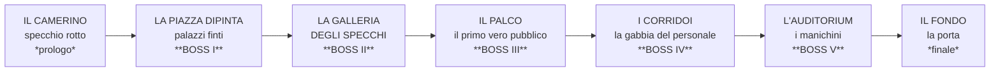

# 🎭 FUORI COPIONE

> *"Non hai un volto. Hai un repertorio."*

Documento di design narrativo. Definisce premessa, mondo, maschere, i cinque boss,
l'ultimo atto e cosa serve implementare.

---

## 📑 Indice

1. [La premessa in una riga](#-la-premessa-in-una-riga)
2. [Perché funziona](#-perché-funziona)
3. [Il mondo: una sola stanza](#-il-mondo-una-sola-stanza)
4. [I manichini](#-i-manichini)
5. [Le maschere](#-le-maschere)
6. [I cinque boss](#-i-cinque-boss)
7. [L'ultimo atto](#-lultimo-atto)
8. [I finali](#-i-finali)
9. [Terminologia](#-terminologia)
10. [Cosa tocca al codice](#-cosa-tocca-al-codice)
11. [Decisioni](#-decisioni)

---

## 🎯 La premessa in una riga

**Sei l'unico personaggio a cui non è stata assegnata una parte, e vuoi uscire
dal teatro che ti contiene.**

Non è un uomo. Non è un mostro. È **un ruolo che non è stato scritto**: in un
mondo dove ogni cosa ha una parte — i palazzi *sono* palazzi, i manichini
*sono* il pubblico, i boss *sono* attori — tu sei l'unica cosa senza copione.

Per questo puoi indossare qualsiasi maschera. Per questo non hai un volto.
Per questo vuoi uscire: **una cosa senza ruolo non appartiene a una recita.**

Il titolo ha un doppio senso voluto: **"fuori copione" è il bust**, la tua
punizione. Ed è anche il tuo obiettivo. Ogni volta che sbagli, assaggi per un
istante la cosa che vuoi.

---

## 🔑 Perché funziona

Non hai applicato un tema teatrale a un gioco di carte. Hai riconosciuto che
**le meccaniche che hai già costruito *sono* teatro.** Ogni regola centrale ha
un equivalente teatrale esatto, non metaforico:

| Meccanica | Significato |
|---|---|
| Nessuna mano: non scegli, peschi | Non scegli le battute: **ti arrivano addosso** |
| **BUST** | **Vai fuori copione** — esci dal personaggio, la scena crolla, il rivale ti ruba il momento |
| Mana non speso → scudo permanente | **La misura è presenza.** Chi non afferra ogni momento accumula autorevolezza, e il pubblico lo copre |
| Le carte non si consumano mai, il mazzo si rimescola | **Il repertorio è eterno.** Nessun ruolo si perde: si ripete, sera dopo sera |
| Risoluzione simultanea, l'ordine non conta | **Il quadro.** Non una sequenza: un *tableau vivant* |
| Il mazzo è l'identità | **Sei ciò che sai recitare** |

Il bust è il cuore. Il gioco è meccanicamente un azzardo: peschi e rischi, e
ogni pesca può umiliarti davanti a chi guarda. Questa **è già** la condizione
di un attore: *"sto per dire la battuta giusta o sto per fare una figuraccia?"*

E in un deck building **non hai una classe**: hai carte che trovi. Sei,
letteralmente, senza volto.

> 💡 **La conseguenza:** il Pubblico non è scenografia, è l'**avversario tematico**.
> Non combatti per uccidere: combatti per **esistere davanti a qualcuno**. Il
> critico del rivale dopo il tuo bust non è un colpo in più — è l'attenzione
> che si sposta su di lui.

---

## 🌍 Il mondo: una sola stanza

**Tutto il gioco è dentro un teatro.** Non un teatro sopravvissuto a
un'apocalisse: *il teatro è tutto ciò che esiste.* Una stanza gigantesca,
e dentro la stanza una città finta.

Il cielo è una **tela dipinta**. I palazzi sono **facciate su cavalletti**,
con il vuoto dietro. Le strade sono **assi di legno viola e velluto consumato**.
Gli alberi sono **di cartapesta**, e si vede la struttura quando ci passi vicino.

Non c'è un "fuori" da raggiungere attraversando un mondo: c'è **un muro**,
dall'altra parte del quale c'è l'uscita. Il gioco è la traversata di una stanza
che non finisce mai.

### La mappa



### Le zone

| Zona | Cos'è | Palette | Funzione |
|---|---|---|---|
| **Il Camerino** | La tua stanza. Uno specchio rotto, maschere appese, un numero sul muro | Grigio-polvere | Prologo, tutorial |
| **La Piazza Dipinta** | La città finta: palazzi su cavalletti, cielo di tela | Viola tenue | Boss I. Impari che niente è vero |
| **La Galleria degli Specchi** | Migliaia di riflessi. Non tutti sono tuoi | Viola freddo | Boss II. Impari che sei sostituibile |
| **Il Palco** | Il palco vero. Per la prima volta **c'è il pubblico** | Oro e rosso | Boss III. Impari il prezzo |
| **I Corridoi** | Il dietro, il personale, i camerini degli altri. E una gabbia | Verde malato | Boss IV. Impari il sistema |
| **L'Auditorium** | La platea. **Migliaia di manichini, immobili** | Viola pieno | Boss V. L'ultimo test |
| **Il Fondo** | Dietro l'ultima fila. Il muro. La porta | — | Finale |

> **Nota di produzione:** tutte le zone usano **lo stesso tileset** con palette
> diverse. È il modo più economico di avere sette ambienti distinti senza
> disegnarne sette. Il viola è la firma visiva del gioco e sale d'intensità
> avvicinandosi al fondo.

### La grande menzogna (e la cosa vera)

Il rischio di un mondo di cartapesta: **se è finto tutto, non importa niente.**
Un fondale non crea posta in gioco.

**La soluzione è una sola: esattamente una cosa è vera.**

Non la scopri con un dialogo. La scopri **guardando**: c'è un manichino in
platea che è **in una posizione diversa ogni volta che torni**. Nessun altro se
ne accorge. Non fa niente, non parla, non ti attacca. È solo... spostato.

Non serve una meccanica. Serve che il giocatore, alla terza volta, si fermi.
È il tuo appiglio emotivo, e costa una variabile.

---

## 🗿 I manichini

**Il pubblico è finto.** Hai recitato tutta la vita per degli oggetti. Nessuno
ha mai veramente guardato.

Questo è il tema del gioco detto **senza una riga di dialogo**, ed è la tua
idea migliore. Tre regole, e non toccarle:

1. **Non si muovono mai.** Ti fissano e basta. Un pubblico immobile è più
   inquietante di uno che si agita.
2. **Non ti attaccano.** Non sono nemici. Sono *spettatori*. Questo li rende
   inattaccabili e, per questo, potenti.
3. **Si girano tutti insieme, una volta sola.** Quando raggiungi il fondo.
   Non serve altro.

E c'è una conseguenza meccanica che vale la pena notare: i boss sono *attori*,
i manichini sono *pubblico*. **I boss recitano per loro.** Quando batti un
boss, i manichini non reagiscono — e questa indifferenza è la cosa più
crudele del gioco.

---

## 🎭 Le maschere

### Cos'è una maschera

**La maschera non cambia le carte: cambia le regole intorno alle carte.**

Perché non "le carte cambiano funzione": significherebbe `200 carte × 9 maschere
= 1800 comportamenti` da progettare e bilanciare, e una carta non avrebbe più
*un* budget di potenza ma nove. Il validatore non saprebbe cosa controllare.

La versione giusta fa **la stessa cosa dal punto di vista del giocatore**
— le carte che valgono cambiano — con una regola invece di mille.

Una maschera è quattro cose:

| Cosa | Come | Riusa |
|---|---|---|
| **Affinità** | quali elementi ti danno sinergia (e quali no) | `SynergyRule` — ✅ esiste |
| **Regola dell'azzardo** | modifica *il rischioso*: bust, scudo, informazione | un hook in `BattleState` |
| **Postura** | ritocchi ai numeri (scudo/mana, decadimento) | `BattleBalance` — ✅ esiste |
| **Il Segno** | un'abilità passiva firmata | sistema F2, da fare |

> **Il punto chiave:** un pacchetto di sinergie diverso **cambia già quali carte
> valgono**. Le stesse carte Fuoco sono ottime sotto la Tragedia e inutili sotto
> la Commedia. Il giocatore percepisce che la carta *ha cambiato funzione*.
> L'hai ottenuto con una regola, non riscrivendo 200 effetti.

La **regola dell'azzardo** è la parte che conta davvero: quattro maschere che
toccano quattro leve diverse del rischio si sentono **più diverse** di venti
carte nuove. Perché cambiano *il cuore del gioco*, non i numeri.

### I due modi di ottenerle

Il gioco ha **due collezioni in un solo loop**, ed è esattamente quello che
volevi all'inizio:

- **Le maschere base** si trovano nei **Bauli di Scena** (i tuoi scrigni)
- **Le maschere dei boss** si **vincono**, sconfiggendoli

E qui c'è il nodo narrativo più forte del gioco: **quando batti un boss ne
prendi la maschera, e diventi lui.** È letteralmente quello che il teatro vuole
da te. Ogni vittoria ti avvicina alla porta e ti allontana da te stesso.

### Le quattro maschere base (nei Bauli)

| Maschera | Affinità | Regola dell'azzardo | Il prezzo |
|---|---|---|---|
| 🎭 **La Tragedia** | Fuoco, Oscuro | Quando vai fuori copione, il critico del rivale è **×3** | Devi giocare difensivo: meno carte, meno danno |
| 🎭 **La Commedia** | Fulmine, Natura | La **prima** volta che vai fuori copione in una scena, non perdi il turno | Danno basso: vinci, ma lentamente |
| 🎭 **L'Inganno** | Veleno, Oscuro | Il primo scudo di ogni turno è **raddoppiato**; il rivale non vede il tuo mana | Nessun danno diretto: se ti chiude, non reagisci |
| 🎭 **Il Presagio** | Ghiaccio, Veleno | **Vedi sempre la prossima carta** prima di decidere | Nessun vantaggio nei numeri: se giochi male, è come non averla |

Quattro maschere, quattro filosofie, **nessuna più forte**: sono quattro modi di
stare sul palco. È lo stesso principio di Attrito vs Burst che già conosci,
applicato all'identità.

> La **Commedia** è l'unica che *perdona*: non calcoli il rischio, lo sfrutti.
> Il **Presagio** è l'unica che trasforma la fortuna in **conoscenza**: il gioco
> smette di essere un azzardo e diventa un calcolo. Chi vuole "giocare bene"
> sceglie questa.

### La struttura dati

```gdscript
class_name MaskData extends Resource

@export var id: StringName
@export var display_name: String
@export var rarity: CardTypes.Rarity        # le maschere hanno rarità: riusa il modello
@export var element_affinity: Array[CardTypes.Element]
@export var synergies: Array[SynergyRule]   # il pacchetto che le dà identità
@export var balance_overrides: BattleBalance  # la postura
@export var gambit: CardTypes.MaskGambit    # quale regola dell'azzardo attiva
@export var drawback: String                # il prezzo, in chiaro
@export var won_from: StringName            # quale boss la lascia (vuoto = si trova)
```

---

## ⚔️ I cinque boss

**Non sono ostacoli: sono i tuoi tentativi precedenti.** Ognuno è qualcuno che
ha provato a uscire, e non ce l'ha fatta. Ognuno è un avvertimento **e** una
tentazione.

La regola che li rende memorabili: **ognuno porta una maschera che non si è più
tolto.** Non serve spiegarlo. Il giocatore lo capisce guardandoli.

---

### I. LA COMPARSA — *non ha mai provato*

> *"Fuori non c'è niente. Meglio qui. Meglio qui."*

| | |
|---|---|
| **Zona** | La Piazza Dipinta |
| **Cos'è** | Un attore che non ha mai avuto una parte, e ha smesso di volerne una |
| **La maschera che porta** | **Nessuna.** Ha smesso di sperare, non di recitare |
| **Il mazzo** | Difesa pura: scudo e cura. **Non ti attacca quasi mai** |
| **Meccanica** | Vuole **stancarti**. Si chiude, si cura, resiste. Non cerca di vincere: cerca che tu smetta |
| **Ti dice** | Il primo ostacolo non è il male: è **la comodità** |
| **La lezione** | È il tutorial del gioco stesso: *la difesa pura non vince mai*. Il tuo boss I è la dimostrazione della tua invariante (`danno > scudo`) |

**Perché è geniale come primo boss:** il giocatore deve *imparare a essere
aggressivo*. La Comparsa è la forma nemica della tentazione di non rischiare.
Chi ha paura del bust resta bloccato qui.

**La maschera che lascia: LA COMPARSA (vuota).**
Non ha una regola dell'azzardo. Non fa niente. **Ed è il punto:** è la maschera
di chi non ha mai osato. Tenerla nell'inventario è una scelta, e pesa.

---

### II. IL SOSTITUTO — *ha provato, è stato copiato*

> *"Ora ci sono tre di me. Nessuno è quello vero."*

| | |
|---|---|
| **Zona** | La Galleria degli Specchi |
| **Cos'è** | Uno come te. Ha provato a uscire, ed è stato sostituito: il teatro ha fatto altre copie |
| **La maschera che porta** | **La tua faccia** |
| **Il mazzo** | **Il tuo.** Gioca esattamente le carte che usi tu |
| **Meccanica** | **Lo specchio.** Non ha un mazzo proprio: copia il tuo `DeckData` al momento dell'incontro |
| **Ti dice** | Che sei **sostituibile**, e che uscire non basta: bisogna essere *irripetibili* |
| **La lezione** | Non puoi vincere giocando come giochi sempre. Devi cambiare maschera |

**Il valore tecnico:** è il boss più economico da fare e il più memorabile.
Riusi il mazzo del giocatore come mazzo nemico. Zero contenuti nuovi, impatto
massimo.

**La maschera che lascia: LO SPECCHIO.**
*Regola dell'azzardo — Riflesso:* quando l'avversario gioca una carta, la tua
copia "riflessa" costa meno il turno dopo. Trasforma la sua forza nella tua.

---

### III. LA PRIMA ATTRICE — *è uscita, e non c'era nessuno*

> *"Ho visto fuori. Non c'era pubblico. Qui almeno qualcuno guarda."*

| | |
|---|---|
| **Zona** | Il Palco (il primo con pubblico vero) |
| **Cos'è** | La star. È **uscita davvero**, ha visto il fuori, ed è tornata |
| **La maschera che porta** | **L'Essere Amato** |
| **Il mazzo** | Burst puro: Ghiaccio e Fulmine. Danno alto, costi alti |
| **Meccanica** | **Ti toglie la voce.** Ti applica *Panico di scena* (Congelato) in grande quantità: non ti fa giocare. È l'unico che ti nega le risorse invece di consumarle |
| **Ti dice** | La tentazione più forte del gioco: **forse fuori non c'è niente, e qui qualcuno ti guarda** |
| **La lezione** | Il dubbio. Da qui in poi il giocatore non è più sicuro che uscire sia la cosa giusta |

**Perché funziona:** è il boss che attacca la **motivazione**, non la vita. E
lei ha un argomento vero, non retorico. Il giocatore deve decidere se crederle.
Chi vuole uscire a tutti i costi la odia. Chi ha dubbi la ascolta.

**La maschera che lascia: L'ESSERE AMATO.**
*Regola dell'azzardo — Perdono:* la prima volta che vai fuori copione, il
pubblico ti perdona. Ma **solo una volta per incontro**: è la maschera
dell'attore che ha esaurito il credito.

---

### IV. IL CARCERIERE — *è diventato guardia per avere un ruolo*

> *"Se ti lascio uscire, mi tolgono la parte."*

| | |
|---|---|
| **Zona** | I Corridoi. La gabbia |
| **Cos'è** | **Era come te.** Ha chiesto una parte, e gliel'hanno data: guardiano di chi vuole uscire |
| **La maschera che porta** | **Il Dovere** |
| **Il mazzo** | Controllo e chiusura: scudo enorme, Congelato, status. Non fa danno spettacolare: ti **blocca** |
| **Meccanica** | **La gabbia.** Ogni turno ti riduce il pubblico disponibile (Mana). Non ti uccide: ti tiene fermo finché non ci rinunci |
| **Ti dice** | Che il sistema non è malvagio: è **fatto di gente che ha accettato** |
| **La lezione** | Il boss più difficile non è il più forte: è quello che ti spegne. Serve pazienza, non potenza |

**Perché funziona:** è il **riflesso futuro** del giocatore. Il Carceriere è la
versione di te che ha smesso di rischiare e si è messa al servizio del teatro.
E la gabbia meccanica è una punizione perfetta: ti toglie proprio ciò che ti
serve per rischiare.

**La maschera che lascia: IL DOVERE.**
*Regola dell'azzardo — Guardia:* il tuo scudo non si consuma per un turno.
Diventi tu il muro. **È la maschera che ti trasforma nel boss che hai appena
battuto**, ed è il momento in cui il tema si chiude sul giocatore.

---

### V. L'ULTIMO — *ha raggiunto la porta e ci sta davanti*

> *"Non puoi uscire da solo. E io non riesco. Quindi restiamo."*

| | |
|---|---|
| **Zona** | L'Auditorium, davanti ai manichini |
| **Cos'è** | È arrivato alla porta. E si è fermato |
| **La maschera che porta** | **Tutte.** Una sopra l'altra. Non è più una persona |
| **Il mazzo** | Tutti gli elementi, tutte le rarità. **Ogni sinergia si attiva** |
| **Meccanica** | **Lo specchio finale.** Non ti attacca con un piano: ti mostra tutto quello che sai fare, usato bene. E non ti fa mai male davvero: ti fa **vedere quanto è lungo il gioco** |
| **Ti dice** | L'ultimo test: **riesci a lasciare qualcuno indietro?** |
| **La lezione** | L'Ultimo non è cattivo, è **solo**. E vuole restare con te |

**Perché è il boss finale giusto:** non c'è un cattivo. C'è una persona che ha
fallito e non vuole fallire da sola. Vincere significa **lasciarlo lì**, ed è
l'unica cosa nel gioco che non sembra una vittoria.

**La maschera che lascia: TUTTE (una).**
Non è una maschera. È un mucchio. *Regola dell'azzardo:* nessuna — ma **ogni
tua maschera è disponibile in ogni turno**. Non devi scegliere prima.
È la libertà assoluta, e ottenerla ha significato battere l'unico essere che
ti somigliava.

---

### Tabella riassuntiva

| # | Boss | Zona | Mazzo | Meccanica | Maschera | Leva del rischio |
|---|---|---|---|---|---|---|
| I | **La Comparsa** | Piazza Dipinta | Difesa pura | Ti stanca | La Comparsa (vuota) | *Non osare* |
| II | **Il Sostituto** | Galleria degli Specchi | Il tuo | Copia | Lo Specchio | *Essere sostituibile* |
| III | **La Prima Attrice** | Il Palco | Burst Ghiaccio/Fulmine | Ti toglie la voce | L'Essere Amato | *Il dubbio* |
| IV | **Il Carceriere** | I Corridoi | Controllo | Ti blocca | Il Dovere | *Spegnersi* |
| V | **L'Ultimo** | L'Auditorium | Tutto | Ti mostra tutto | Tutte | *Restare* |

---

## 🎬 L'ultimo atto

### La scoperta

Dopo L'Ultimo, **non c'è un sesto boss.** C'è una scoperta:

**La porta "EXIT" che hai visto per tutto il gioco è dipinta sul fondale.**
Fa parte della scenografia. Non è mai stata un'uscita.

E allora dov'è?

**Dietro il pubblico.**

L'unica via d'uscita dal teatro è **attraversare la platea**. Camminare dentro
l'auditorium, tra i manichini, fino all'ultima fila, e uscire dal fondo.

Ecco perché nessuno è mai riuscito: **nessuno ha capito che la fuga non è dal
palco. È attraverso chi guarda.** Non puoi uscire da una recita: puoi solo
attraversare il pubblico e andartene.

### I manichini si girano

Mentre attraversi la platea, **si girano tutti verso di te. Insieme. Una volta
sola**, e solo alla fine.

Non ti attaccano. Non ti parlano. Si girano e basta.

È l'unica azione che fanno in tutto il gioco, e per questo è la scena più
forte. E non serve un dialogo: serve una rotazione di sprite, tutti nello
stesso frame.

### La rivelazione

Alla porta, capisci cos'eri.

**Non sei un attore fuggito. Sei un ruolo che non è stato scritto**, e il
teatro non sapeva dove metterti. Le maschere non erano un travestimento: erano
**il tuo modo di esistere** in un mondo dove si esiste solo avendo una parte.

E ora, per uscire, devi **toglierle tutte**. Fuori non ci sono parti.

**Fuori c'è qualcosa.** Non è il vuoto, e non è un premio: è il **reale**, dove
nessuno ha un copione, nessuno ti guarda, e **nessuno si ricorderà di te**.

Ecco l'ultima domanda del gioco, che non è mai stata "riesci a uscire?":

> **Riesci a esistere senza essere guardato?**

---

## 🏁 I finali

Tre finali, tutti coerenti col tema. **Nessuno è "quello giusto".**

### 1. Esci vuoto
*Ti togli tutte le maschere e attraversi la porta senza niente.*

Sei libero. Sei anche **niente**: nessun ruolo, nessun volto, nessun nome.
Nessuno saprà mai che sei stato qui, e nessuno si ricorderà di te.

> *È la libertà, e ha il costo esatto che il gioco ti aveva promesso per tutto
> il tempo.*

### 2. Esci pieno
*Attraversi la porta con tutte le maschere addosso.*

Non esci davvero: **il teatro esce con te**. Le porti fuori, e dove vai le
persone iniziano a guardarti. Diventi tu il prossimo teatro — gentile, pieno di
storie, e affamato di pubblico.

> *È la scelta più umana del gioco. Ed è l'unica in cui il ciclo non si rompe.*

### 3. Non esci
*Ti fermi davanti alla porta e ti togli le maschere, ma resti.*

Non fuggi e non torni indietro: **rinunci a entrambe le cose**. Ti togli tutto
e diventi, per la prima volta, una persona con un volto solo — in un posto che
non ha più potere su di te perché non gli stai più chiedendo niente.

> *È il finale più difficile, e l'unico che rompe il teatro senza rompere te.*
> *Non sei libero e non sei al sicuro. Sei solo, finalmente, tuo.*

---

## 📖 Terminologia

Usare i termini giusti fa metà del lavoro narrativo. Proposta:

| Meccanico | Nel gioco | Perché |
|---|---|---|
| Mana | **Pubblico** | L'attenzione che hai in questo momento |
| Scudo | **Favore** | L'attenzione non spesa *resta addosso*: il pubblico ti copre |
| Bust | **Fuori copione** | Esci dal personaggio, la scena crolla |
| Critico nemico | **Ti ruba la scena** | Non è danno: è attenzione che passa di mano |
| Mazzo | **Repertorio** | I ruoli che sai recitare |
| Mazzo di pesca | **Copione** | Ciò che la scena ti riserva |
| Carta | **Battuta** | La singola mossa |
| Livello | **Gavetta** | La tua anzianità nella compagnia |
| Rimescolo | **Si ricomincia la scena** | Nulla si perde mai |
| Brucia | **Riflettori** | I riflettori ti bruciano addosso |
| Veleno | **Maldicenza** | Si accumula, rode, non passa da sola, non la fermi con la difesa |
| Congelato | **Panico di scena** | Ti toglie pubblico: la paura ti blocca |
| Potenziato | **Ispirazione** | Il momento in cui tutto riesce |
| Rigenerazione | **Bis** | Il pubblico ti richiama, ti dà forza |
| Rarità Base | **Ruolo Base** | |
| Rarità Rara | **Ruolo di Rilievo** | |
| Rarità Epica | **Ruolo da Cartellone** | |
| Rarità Leggendaria | **Ruolo da Locandina** | |
| Rarità Unica | **Ruolo Unico** | |

> **Brucia → Riflettori** e **Veleno → Maldicenza** sono le più azzeccate:
> la maldicenza si accumula, rode, persiste e **non la fermi con la difesa**
> — esattamente come il danno da status nel tuo motore.

---

## 🔧 Cosa tocca al codice

Buona notizia: quasi tutto riusa quello che esiste.

| Pezzo | Stato | Lavoro |
|---|---|---|
| `SynergyRule` | ✅ esiste | Una maschera contiene un array di regole. **Zero codice nuovo** |
| `BattleBalance` | ✅ esiste | La postura è un preset di balance. Riuso diretto |
| Rarità maschere | ✅ esiste | `RarityProfile` vale anche per loro |
| Boss II (Il Sostituto) | ✅ quasi gratis | Usa il `DeckData` del giocatore come mazzo nemico |
| Boss I (La Comparsa) | ✅ quasi gratis | È il mazzo **Fortezza** che hai già |
| **Vedere la prossima carta** (Presagio) | 🟡 quasi gratis | `draw_pile.back()` è già leggibile |
| **Bust perdonato / crit ×3** | 🟡 piccolo | Il bust è gestito in **un punto solo** (`battle_state.gd:210`): un hook lo copre |
| **Scudo raddoppiato / non consumato** | 🟡 piccolo | Un moltiplicatore nel calcolo dello scudo |
| `MaskData` + `MaskLibrary` | ❌ da fare | Sul modello di `CardData` + `CardLibrary` |
| Dock maschere (nell'editor) | ❌ da fare | Sul modello del dock Carte |
| **Il Segno** (abilità passiva) | ❌ manca | Richiede il sistema F2, già previsto |
| I manichini che si girano | ❌ da fare | Non è codice: è una scena |

**Il messaggio da portarsi via:** le Maschere sono **uno strato sopra il motore**,
non un rifacimento. Le regole dell'azzardo sono quattro hook piccoli in un file
solo.

> ⚠️ **L'unica cosa davvero costosa:** le abilità passive. Senza di quelle, i
> "Segni" non esistono e le maschere si riducono ad affinità + regola
> dell'azzardo. Restano buone, ma non memorabili. Ora però quel lavoro ha una
> motivazione fortissima: **senza di esso, il tema del gioco resta a metà.**

---

## ✅ Decisioni

### Prese (e perché)

| Domanda | Scelta | Motivo |
|---|---|---|
| **L'entità sei tu o un'altra cosa?** | **Sei tu.** Sei un ruolo mai scritto | Più economico da raccontare, e lega le maschere all'identità invece che a un secondo personaggio |
| **Fuori c'è qualcosa?** | **Sì, ma non è un premio.** È il reale: nessun ruolo, nessun pubblico | Dà peso alla scelta senza renderla una ricompensa. Il tema resta: *esistere senza essere guardato* |
| **I manichini si muovono?** | **Mai, tranne due volte:** quello che si sposta (che è l'unica cosa vera) e tutti insieme alla fine | Massimo effetto, costo minimo |
| **Il villaggio?** | **Sparisce.** Tutto è dentro un teatro | La tua idea lo ha reso superfluo: un solo mondo è più coerente e più economico |

### Da prendere

1. **Il giocatore può cambiare maschera *durante* un incontro?** Se sì, il
   Presagio e la Commedia diventano molto più forti e il gioco più tattico.
   Se no, la scelta è "a inizio scontro" ed è più leggibile. **Consiglio: no**,
   almeno all'inizio — una maschera per incontro mantiene le identità nette.
2. **Quanti Bauli e dove?** Consiglio: **uno per zona**, più qualcuno segreto
   nelle zone già battute. Premia chi torna indietro.
3. **Le maschere dei boss si possono *rifiutare*?** Rifiutarle sarebbe
   potentissimo a livello tematico (non vuoi diventare loro) ma toglierebbe
   contenuto. **Consiglio: si prendono sempre, e il peso è nell'uso.**
